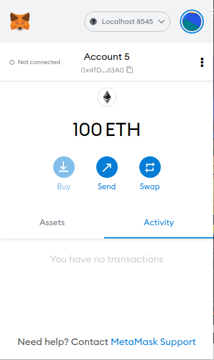

### Install the  following applications in your system
 1. Ganache
 2. Metamak (chrome extension)
### Deploy the contracts in the blockchain network
1. Open Ganache and select quick start
1. Make sure you have truffle installed
2. Use the link to install truffle https://www.npmjs.com/package/truffle
3. Once installed use code > [truffle deploy] .. in the terminal.
4. The address in the contract present in `build/contracts/_.js` will change
5. Copy the address of each contracts and paste it in the `src/contracts/_.js  PATIENT_DATA_LIST_ADDRESS`
### create account in metamask
1. copy one of the private key present in Ganache app
2. Import the private key in the metamask to create account
3. change `not connected` to `connected` 

### To run the project
`npm update` then `npm start` And now you can start saving the patient data.
### Idea behind this project

Blockchain based Database to secure patient data and ensure privacy

# INTRODUCTION

A blockchain is a publicly-managed and verified record of transactional data. All of the data blocks are ordered chronologically and are connected to form a “chain” — hence, the term “blockchain.” All of the chain’s old blocks of data are permanent; they can’t be modified or altered retroactively.
​ Blockchain networks depend on a healthy population of full nodes, i. e. individual peers that store, verify and distribute the full set of data comprising the blockchain—the history of all past transactions. And blockchains are commonly advertised as being immutable, making it impossible to change or erase already posted data. The idea we are submitting uses the method called encryption and hashing to store the data in blockchain in an encrypted form so that no one without the key should be able to see the content of blockchain unless the permission is granted to the user. This can be achieved if we effectively store the key in such a way that nobody can access it and when required it will be readily available. To achieve such a system we had to do some of the work off-chain i.e outside the blockchain. We created a third party system, this system is centralised system making it a perfect candidate to ensure privacy. The main objective of the third party system is to store a unique key of the data (patient data) in such a way that even this third party system will not be able to access the data even with the key stored in it.

Figure 1: Three major components of our application’s architecture to ensure privacy in blockchain

# CONCLUSIONS

We know that the data in blockchain is immutable i.e once the data is written in the blockchain it cannot be deleted and any body have access to the blockchain network can access the any data  present inside the blockchain which is a major issue with blockchain especially if we want to create a database in the blockchain which needs to be deleted once its work is over or if any user wants its data to be removed from the database or if you don't want to share your data with everyone or you want to share your data with the selected few. So in order to achieve a little privacy inside the blockchain we created this method where the original data is encrypted twice first locally and then in the Third party system. And when we send the data to the  blockchain the data is in encrypted form so it means that  if somebody tries to look inside the blockchain to steal the data for fault reasons it will be useless as the person will not be able to understand this data. In case if a user would one day wish its data to be deleted from the blockchain it can be apparently done by deleting all the keys associated with the data in order to decrypt the data. It means that the key of the encrypted data present in the Third Party System’s database associated with its respective owner will simply be deleted. Once the key is deleted the encrypted data is nothing more than random bits which are totally useless and cannot be utilized in any shape or form. This is how our method works to achieve privacy within blockchain.

Figure 3: An image showing locally decrypted data retrieved from the blockchain in encrypted form.

# REFERENCES

- “Blockchain”  https://en.wikipedia.org/wiki/Blockchain
- “Ethereum” https://ethereum.org/en/
- “Smart Contracts”  https://ethereum.org/en/developers/docs/smart-contracts/
- “SHA-256” https://en.wikipedia.org/wiki/SHA-2
- “AES”  https://www.educative.io/edpresso/what-is-the-aes-algorithm
- "How to Build Ethereum Dapp with React.js · Complete Step-By-Step Guide" https://www.dappuniversity.com/articles/ethereum-dapp-react-tutorial

